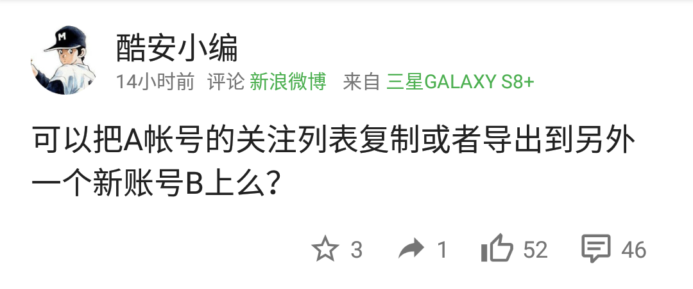

# 微博批量关注 (转移关注列表)
好像并没有什么卵用

## 起因
<div></div>

## 使用方法
### 得到A账号关注列表
1. 前往微博H5版首页([https://m.weibo.cn/beta](https://m.weibo.cn/beta))
2. 登录A账号，并记下A账号uid
3. F12打开控制台，复制下面代码并填写A账号uid，粘贴到控制台，等待结果并复制
```javascript
(function getAllFollows(){
	let uid = ?????????? //A账号uid
	let allFollows = []
	function getFromFollowPage(page){
		let xhr = new XMLHttpRequest()	
		xhr.onreadystatechange=function()
		{
			if(xhr.readyState==4&&xhr.status==200){
				let data = JSON.parse(xhr.responseText)
				if (data.msg=="这里还没有内容")
					return
				for(let i=0;i<data.cards.length;i++)
					allFollows.push(data.cards[i].user.id)
				getFromFollowPage(page+1)
			}
		}
		xhr.open('GET',"https://m.weibo.cn/api/container/getSecond?luicode=10000011&lfid=100505"+uid+"&uid="+uid+"&containerid=100505"+uid+"_-_FOLLOWERS&page="+page,0)
		xhr.send()
	}
	getFromFollowPage(1)
	return JSON.stringify(allFollows)
})()
```
注：由于接口原因可能无法获得完整关注列表

### B账号按列表批量关注
1. 前往PC版首页([https://weibo.com/](https://weibo.com/))
2. 注销A账号，登录B账号
3. F12打开控制台，复制下面代码并填写uid列表，粘贴到控制台，等待全部关注完成
```javascript
(function autoFollow(){
	let list = [...] //填写上一步得到的uid列表
	function addFollow(uid){
		let xhr = new XMLHttpRequest()	
		xhr.onreadystatechange=function()
		{
			if(xhr.readyState==4&&xhr.status==200){	
				let data = JSON.parse(xhr.responseText)
				if(data.code==100000){
					console.log(uid.toString(),data.data.fnick,"关注成功")
				}
				else if(data.code==100001){
					console.log(uid.toString(),"关注失败")
				}
			}
		}
		xhr.open('POST', "https://weibo.com/aj/f/followed?ajwvr=6&__rnd="+new Date().getTime(), true)
		xhr.setRequestHeader('Content-type', 'application/x-www-form-urlencoded')
		xhr.send("uid="+uid+"&objectid=&f=1&extra=&refer_sort=&refer_flag=1005050001_&location=page_100505_home&oid="+uid+"&wforce=1&nogroup=false&fnick=&refer_lflag=&refer_from=profile_headerv6&_t=0")
	}
	function followByList(index){
		if (index>list.length){
			console.log("全部完成")
			return
		}
		else{
			console.log(index+1+"/"+list.length)
		}
		addFollow(list[index])
		setTimeout(function(){
			followByList(index+1)
		},2000)
	}
	followByList(0)
})()
```
注：接口似乎完全不管重复关注